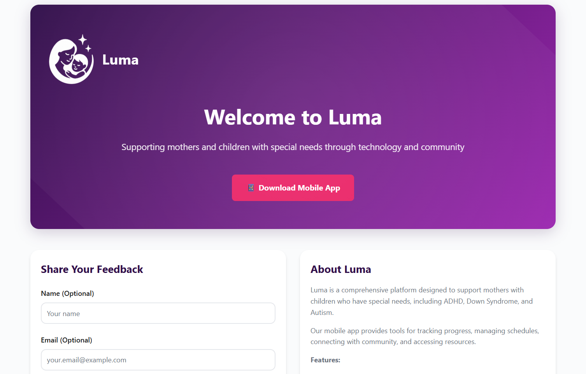
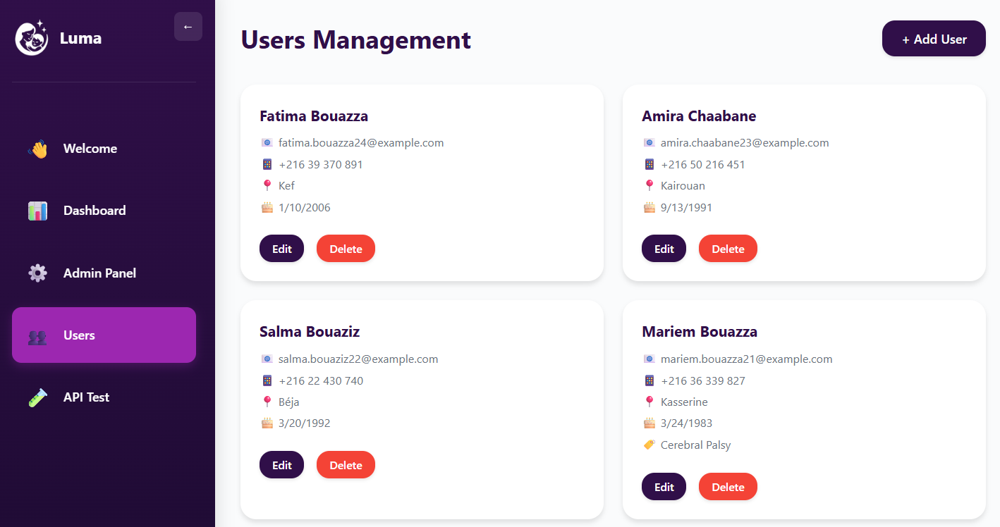
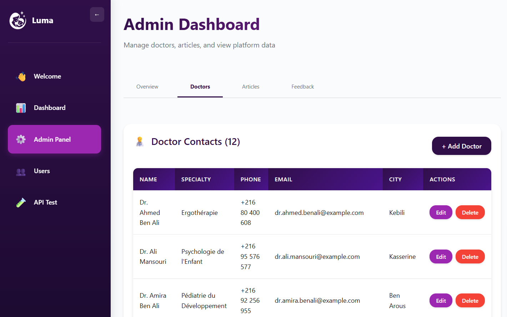

# Luma Web App

<div align="center">
  
  
  A modern React web application for managing the Luma platform. Features an admin dashboard for managing doctors, articles, feedback, and viewing user analytics. The app matches the theme and design of the mobile application.
</div>

## Screenshots

### Welcome Page & Dashboard

<div align="center">
  
</div>

### Admin Dashboard

<div align="center">
  
  
  
  
</div>

### Content Management

<div align="center">
  
  
</div>

## Features

- 🎨 **Matching Theme**: Uses the same color scheme as the mobile app (purple primary #300F49)
- 🔐 **Admin Login**: Secure login page for admin access (demo mode)
- 📊 **Admin Dashboard**: Comprehensive admin panel with KPIs and data management
- 👥 **User Management**: View user statistics and analytics
- 👶 **Kids Management**: Full CRUD operations for kids with filtering by user
- 👨‍⚕️ **Doctors Management**: CRUD operations for healthcare providers
- 📰 **Articles Management**: Manage scientific articles and wellness content
- 💬 **Feedback Management**: View and manage user feedback
- 📍 **Location Analytics**: View user distribution by city and country
- 🧪 **API Testing**: Interactive API testing interface
- 🎯 **Modern UI**: Clean, responsive design with styled-components and sidebar navigation

## Tech Stack

- **React 18** - UI library
- **Vite** - Build tool and dev server
- **React Router** - Navigation
- **Axios** - HTTP client
- **Styled Components** - CSS-in-JS styling

## Installation

1. Install dependencies:

```bash
npm install
```

2. Create a `.env` file (optional):

```env
VITE_API_URL=http://localhost:3000/api
```

If not set, it defaults to `http://localhost:3000/api`.

## Running the App

### Development mode:

```bash
npm run dev
```

The app will start on `http://localhost:5173` (or next available port).

### Build for production:

```bash
npm run build
```

### Preview production build:

```bash
npm run preview
```

## Make Sure Backend is Running

Before using the web app, ensure the backend server is running:

```bash
cd ../luma-backend
npm run dev
```

The backend should be running on `http://localhost:3000` (or the port specified in your backend `.env`).

## Pages

- **Login** (`/login`) - Admin login page (demo mode - accepts any credentials)
- **Welcome** (`/welcome`) - Public welcome page with feedback form and mobile app download link
- **Dashboard** (`/`) - Overview with statistics and API status
- **Admin Dashboard** (`/admin`) - Full admin panel with:
  - Overview tab: KPIs, user statistics, location analytics (cities and countries)
  - Doctors tab: CRUD operations for healthcare providers
  - Articles tab: CRUD operations for scientific articles
  - Feedback tab: View and manage user feedback
- **Users** (`/users`) - Manage users (create, read, update, delete)
- **Kids** (`/kids`) - Manage kids with user filtering
- **API Test** (`/api-test`) - Interactive API testing interface

## Project Structure

```
luma-web-app/
├── src/
│   ├── assets/
│   │   └── logo/              # Logo images (dark, light, white variants)
│   ├── components/            # Reusable UI components
│   │   ├── Layout.jsx         # Main layout with sidebar
│   │   ├── Sidebar.jsx        # Collapsible sidebar navigation
│   │   ├── Logo.jsx           # Logo component with variants
│   │   ├── Button.jsx
│   │   ├── Card.jsx
│   │   └── Input.jsx
│   ├── pages/                # Page components
│   │   ├── Login.jsx          # Admin login page
│   │   ├── Welcome.jsx        # Public welcome page
│   │   ├── Dashboard.jsx      # Main dashboard
│   │   ├── AdminDashboard.jsx # Admin panel
│   │   ├── Users.jsx
│   │   ├── Kids.jsx
│   │   └── ApiTest.jsx
│   ├── services/              # API service layer
│   │   └── api.js            # Axios API client
│   ├── theme/                # Theme configuration
│   │   ├── colors.js         # Color palette
│   │   └── globalStyles.js   # Global styles
│   ├── App.jsx               # Main app component with routing
│   └── main.jsx              # Entry point
├── index.html
├── package.json
└── vite.config.js
```

## Color Theme

The app uses the same color scheme as the mobile app:

- **Primary**: #300F49 (Dark Purple)
- **Primary Light**: #4A148C
- **Primary Dark**: #1A0A2E
- **Secondary**: #9C27B0 (Purple)
- **Accent**: #E91E63 (Pink)
- **Background Light**: #FAFBFC (Light Gray)
- **Background Dark**: #300F49
- **Success**: #4CAF50 (Green)
- **Error**: #F44336 (Red)
- **Warning**: #FF9800 (Orange)
- **Info**: #2196F3 (Blue)

## API Endpoints

### Authentication

- `POST /api/users/register` - Register new user
- `POST /api/users/login` - Login user

### Users

- `GET /api/users` - Get all users
- `GET /api/users/:id` - Get user by ID
- `PUT /api/users/:id` - Update user
- `DELETE /api/users/:id` - Delete user

### Kids

- `GET /api/kids` - Get all kids
- `GET /api/kids/:id` - Get kid by ID
- `GET /api/kids/users/:userId/kids` - Get kids by user ID
- `POST /api/kids` - Create kid
- `PUT /api/kids/:id` - Update kid
- `DELETE /api/kids/:id` - Delete kid

### Doctors

- `GET /api/doctors` - Get all doctors
- `GET /api/doctors/:id` - Get doctor by ID
- `POST /api/doctors` - Create doctor
- `PUT /api/doctors/:id` - Update doctor
- `DELETE /api/doctors/:id` - Delete doctor

### Articles

- `GET /api/articles` - Get all articles
- `GET /api/articles/:id` - Get article by ID
- `POST /api/articles` - Create article
- `PUT /api/articles/:id` - Update article
- `DELETE /api/articles/:id` - Delete article

### Feedback

- `GET /api/feedback` - Get all feedback
- `GET /api/feedback/:id` - Get feedback by ID
- `POST /api/feedback` - Create feedback
- `PUT /api/feedback/:id/read` - Mark feedback as read
- `DELETE /api/feedback/:id` - Delete feedback

### Events

- `GET /api/events` - Get all events
- `POST /api/events` - Create event

### Game Progress

- `GET /api/game-progress` - Get all game progress
- `POST /api/game-progress` - Create/update game progress

### Community

- `GET /api/community` - Get all community posts
- `POST /api/community` - Create post

### Health

- `GET /api/health` - Check API status

## Features in Detail

### Admin Dashboard

- **Overview Tab**:
  - Key Performance Indicators (KPIs)
  - User statistics (total users, kids, events, etc.)
  - Location analytics with visual charts
  - User distribution by country and city
- **Doctors Tab**:
  - View all doctors
  - Add new doctors with full details
  - Edit existing doctors
  - Delete doctors
- **Articles Tab**:
  - View all articles
  - Add new articles
  - Edit existing articles
  - Delete articles
- **Feedback Tab**:
  - View all user feedback
  - Mark feedback as read/unread
  - Delete feedback

### Welcome Page

- Hero section with Luma branding
- Mobile app download link
- Feedback form for public users
- About section

## Development

### Adding New Pages

1. Create a new component in `src/pages/`
2. Add route in `src/App.jsx`
3. Add menu item in `src/components/Sidebar.jsx` if needed

### Styling

The app uses styled-components for all styling. Colors are centralized in `src/theme/colors.js`.

## License

ISC

## Author

Developed by **nermine.ouada**
